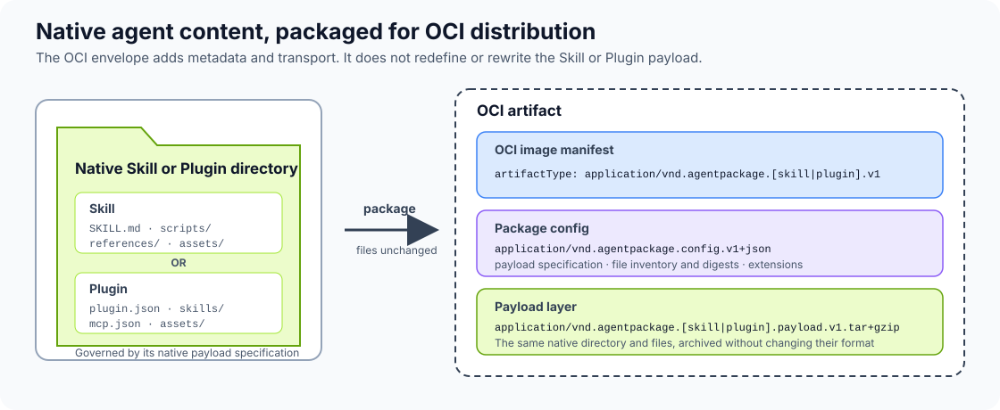

# Agent Package Specification

This repository proposes a standard way to package and distribute **agent
skills and agent plugins as OCI artifacts**. The aim is to give publishers,
registries, marketplaces, and agent hosts a common distribution format that
works with existing OCI tooling for versioning, signing, verification, and
promotion.

The [draft specification](spec/agent-package.md) preserves the native Skill or
Plugin files and adds an OCI manifest, package metadata, and a verifiable file
inventory around them. A Skill or Plugin package is an OCI artifact; it does
not need to be a container image that runs an application.

**This is a proposal for community review, not an adopted standard.** Feedback
and implementation experience are welcome. Media types, namespace ownership,
and other design details remain provisional.



The payload remains governed by its native specification, such as the
[Agent Skills specification](https://agentskills.io/specification) or the
[Agent Plugins specification](https://agent-plugins.org/specification). The
OCI manifest and package config add typed discovery, inventory, verification,
and distribution metadata around those unchanged files.

## Why package Skills and Plugins?

### Build one verifiable release artifact

A Skill or Plugin is normally authored as a directory containing instructions,
metadata, scripts, references, assets, hooks, or other related files. Source
control is the right place to develop those files, but a repository branch or
directory can change. Publishers and consumers need to identify exactly which
files belong to a particular release.

An explicit build step creates one immutable, versioned distribution unit. A
marketplace, scanner, installer, and user can then operate on the same output.
The artifact can be validated, signed, approved, promoted, installed, and
rolled back by digest without reconstructing a release from a mutable branch
or repository directory. Consumers can also apply revocation policy to a
specific artifact digest.

Local source-based development remains useful. This proposal separates that
authoring workflow from managed distribution; it does not replace it.

### Use OCI as the distribution envelope

A standalone archive can carry the files, but it does not by itself provide a
shared model for naming, versioning, discovery, signatures, or attestations.
The Open Container Initiative (OCI) supplies that surrounding model through
content-addressed digests, registry distribution, typed manifests, and
referrers that associate signatures and attestations with an artifact.

The proposed artifacts still carry ordinary Skill or Plugin files in a
compressed archive. OCI provides the envelope around those files so existing
registries and supply-chain tooling can distribute and verify them.

## Design at a glance

- Skills and Plugins use distinct OCI artifact types.
- Both use one common package-config format and validation model.
- Artifact content is independent of the registry location where it is
  published.
- Each artifact inventories the files it carries and their digests.
- Each v1 artifact is self-contained; a Plugin carries any bundled Skills in
  its own payload.
- Signatures, security results, approvals, and provenance can be attached as
  OCI referrers without changing the packaged files.

The OCI layer digest verifies the packaged archive during distribution. The
per-file inventory verifies the regular file bytes after materialization and
supports detection of missing, unexpected, or changed files.

## Illustrative Example Workflow

An Agent Package moves through the same supply-chain stages as other OCI
artifacts: build, validate, publish, sign, verify, and install.

The `agent-package-cli` commands below illustrate the intended developer
experience. They describe a proposed reference CLI; the command names are not
yet part of the specification.

### Publisher flow

The following commands can run in the publisher's environment or a CI pipeline.
This example starts from a native Plugin directory, but the same workflow
applies to a Skill.

```console
$ cd example-plugin

$ ls
assets/  mcp.json  plugin.json  skills/

$ agent-package-cli build . --output ./dist
Built Plugin package: ./dist/example-plugin.oci

$ agent-package-cli validate ./dist/example-plugin.oci
Valid Agent Package

$ agent-package-cli push ./dist/example-plugin.oci \
    ghcr.io/example/example-plugin:1.2.3
Published: ghcr.io/example/example-plugin@sha256:...
```

Once published, standard supply-chain tools can sign the immutable artifact
digest and attach attestations:

```console
$ cosign sign ghcr.io/example/example-plugin@sha256:...

$ cosign attest \
    --type custom \
    --predicate provenance.json \
    ghcr.io/example/example-plugin@sha256:...
```

### Consumer flow

A consumer verifies the immutable artifact before installation:

```console
$ cosign verify \
    --certificate-identity <expected-identity> \
    --certificate-oidc-issuer <expected-issuer> \
    ghcr.io/example/example-plugin@sha256:...

$ cosign verify-attestation \
    --certificate-identity <expected-identity> \
    --certificate-oidc-issuer <expected-issuer> \
    ghcr.io/example/example-plugin@sha256:...

$ agent-package-cli install \
    ghcr.io/example/example-plugin@sha256:...
Installed Plugin: example-plugin

$ ls example-plugin
assets/  mcp.json  plugin.json  skills/
```

The installer pulls the manifest, Package Config, and payload; validates their
media types and digests; safely materializes the native Plugin directory; and
records the immutable source digest. The Plugin files themselves remain in
their native format.

ORAS can also transport or inspect the underlying artifact directly:

```console
$ oras pull \
    ghcr.io/example/example-plugin@sha256:... \
    --output ./download
```

Pulling with ORAS retrieves the artifact content. A conforming Agent Package
installer additionally performs package validation, safe extraction, inventory
verification, and installation.

## Scope

The proposal aims to standardize the packaging and distribution boundary. It does not
redefine the internal semantics of the Agent Skills or Agent Plugins formats,
mandate a host-specific installation directory, or define a universal runtime
permission model.

## Prior work

This proposal acknowledges and builds on earlier work to package agent skills
with OCI:

- Pavel Anni's Red Hat Emerging Technologies
  [skillimage and `skillctl` project](https://github.com/redhat-et/skillimage),
  which explores an OCI-based registry and lifecycle tooling for agent skills.
- Thomas Vitale's
  [Agent Skills OCI Artifacts Specification](https://github.com/ThomasVitale/agents-skills-oci-artifacts-spec),
  which proposes a standard OCI artifact format for packaging, distributing,
  signing, and tracking Agent Skills.

The design in this repository is particularly close to Vitale's proposal. It
extends the scope from Agent Skills alone to a common packaging and distribution
model for both Skills and Plugins.

## Read the proposal

- [Agent Package Specification](spec/agent-package.md)

## Status

This work is an initial draft for community review. Implementations should not
assume that provisional names or structures are stable. The repository is a
place to discuss the design, test interoperability, and improve the proposal.

The long-term goal is a specification maintained by the community under an
appropriate open governance model. No standards body or future governance
home has been selected. See [GOVERNANCE.md](GOVERNANCE.md) for the current
draft-stage process.

## Provide feedback

Use [GitHub issues](../../issues) for design questions, interoperability
feedback, implementation experience, and proposed clarifications. Pull
requests are welcome for concrete wording or schema changes. See
[CONTRIBUTING.md](CONTRIBUTING.md) for the review process.

Please report security vulnerabilities privately as described in
[SECURITY.md](SECURITY.md).

## Change process

The proposal evolves through public issues and pull requests. Material design
changes should explain their motivation, compatibility impact, and security or
interoperability implications. See [GOVERNANCE.md](GOVERNANCE.md) for the
current draft-stage process.

## License

This project uses the CC-BY-4.0 AND Apache-2.0 dual-license terms:
documentation, skills, and assets are licensed under CC-BY-4.0, and source
code is licensed under Apache-2.0. See [LICENSE](LICENSE) for the complete
license terms.
